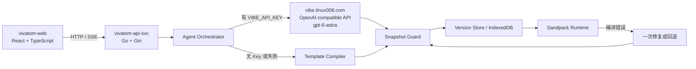

# vivatom 产品需求与技术方案

## 1. 背景与成功定义

命题要求实现一个类似 Atoms 的网页应用：用户通过智能体驱动的方式生成代码或应用，并直接看到可运行的网页结果。Demo 必须有真实交互、数据持久化、基本使用流程、至少一个延展能力，并最终提供公开访问链接与 GitHub 源码。

vivatom 不复制 Atoms 的全部商业平台。它完整复现最能证明命题要求的产品闭环：

> 描述应用 -> 多智能体制定计划 -> 人工批准 -> 生成多文件 React 代码 -> 沙箱运行 -> 对话迭代 -> 版本与 Diff -> Race Mode 比较方案

成功标准：第一次接触产品的评审可以在五分钟内完成上述闭环，并确认生成结果是真实代码、可以运行、可以修改、刷新后不会丢失。

## 2. 产品范围

### 2.1 本次必须完成

1. 项目首页与创建项目入口。
2. 自然语言需求输入及示例 Prompt。
3. Engineer、Team、Race 三种工作模式。
4. Mike、Emma、Bob、Alex 四个可见智能体角色及明确交接过程。
5. Emma 产品计划与 Bob 技术计划，以及用户“批准并生成”节点。
6. GPT-6 Astra 生成多文件 React + TypeScript 项目。
7. 无可用模型时的确定性模板生成通道。
8. Preview、Code、Plan、Versions 四个工作台视图。
9. Sandpack 中的真实编译与隔离预览。
10. Desktop、Tablet、Mobile 预览尺寸切换。
11. Console 错误呈现、一次自动修复和最后可用版本回退。
12. 对话式迭代，并产生新版本与文件 Diff。
13. Race Mode 并行产生两个视觉方案，选择一个作为后续主版本。
14. IndexedDB 持久化项目、消息、计划、文件和版本。
15. 项目源码 ZIP 导出。

### 2.2 明确不在本次范围

- 生成任意后端服务或执行任意 shell 命令。
- 为生成应用提供真实数据库、登录、Stripe 或对象存储。
- 为每个生成应用自动创建独立云部署。
- GitHub OAuth、自动建仓库和双向同步。
- 自定义域名、App World、团队协作和权限系统。
- SEO、广告、分析等增长智能体。
- 完全复刻 Atoms 的品牌、文案和像素级视觉。

生成范围固定为浏览器内可运行的 React + TypeScript 前端应用。应用可以是 Landing Page、Dashboard、目录、表单工具或轻量管理界面，并应包含至少一个真实交互。

## 3. 核心用户体验

### 3.1 创建与计划

用户从首页新建项目，输入应用需求并选择模式。Team 为默认模式。提交后：

1. Mike 创建任务并显示阶段进度。
2. Emma 基于需求产出目标用户、核心功能、页面和验收点。
3. Bob 基于 Emma 的结果产出文件结构、组件边界、数据与交互方案。
4. 工作台展示统一计划，暂停在人工批准节点。
5. 用户可以批准，或补充一句要求后重新生成计划。

三种模式的行为固定如下：

- Engineer：Alex 直接产出一份轻量计划，用户批准后单路生成；适合最快完成原型。
- Team：Emma 和 Bob 分别产出产品与技术计划，用户批准后由 Alex 生成；这是默认演示路径。
- Race：先执行 Team 的计划阶段，再并行运行两个具有不同视觉方向的 Alex 分支。

### 3.2 构建与预览

用户批准后，Alex 生成一组符合 `ProjectSnapshot` 契约的文件。系统先校验文件，再创建版本并送入 Sandpack。右侧 Preview 自动显示真实运行结果，Code 可检查和编辑具体文件，Console 显示编译或运行问题。

每个生成项目必须包含至少一个可验证交互，例如筛选、表单提交、列表状态切换或主题切换。涉及用户输入或记录变更的模板使用带项目前缀的 `localStorage` 键保存预览内数据，使生成应用自身在预览刷新后也保持状态。

### 3.3 迭代与版本

用户在对话框继续提出修改。Alex 接收当前计划、当前文件和修改要求，只返回必要的文件变更。每次成功修改都产生一个不可变版本。Versions 支持切换历史版本；Code 中可比较任意相邻版本的文件 Diff。

### 3.4 Race Mode

Race Mode 是本次延展能力。它在同一批准计划上并行运行两个 Alex 生成分支：

- Candidate A：克制、产品化、信息层级优先。
- Candidate B：表达性更强、视觉冲击和动效优先。

两个候选均通过相同校验并在双预览中运行。用户选择胜者后，胜者成为新主版本；未选候选仍保留在 Race 记录中，但不进入主版本链。

### 3.5 重开与导出

项目、消息、计划、版本和 Race 选择写入 IndexedDB。刷新页面或重新打开浏览器后，用户可以从项目首页继续。顶部 Export 下载包含源码和项目说明的 ZIP。

## 4. 工作台信息架构

### 4.1 桌面布局

- 最左 52px 导航栏：项目、搜索、版本入口和设置。
- 左侧约 330px 对话栏：项目名、模式、智能体、对话时间线、批准卡片和输入框。
- 右侧弹性工作区：Preview、Code、Plan、Versions 标签。
- 顶部操作区：当前版本、运行状态和 Export。
- Preview 工具栏：设备尺寸、刷新、打开独立预览。
- 底部折叠 Console：构建状态、错误和一键修复。

### 4.2 视觉语言

工作名称使用 vivatom，避免冒充 Atoms 品牌。界面以深灰导航、白色工作区、靛青到青色强调色为主；卡片圆角克制，状态使用语义色。动效只服务于智能体接力、生成进度、版本切换和 Race 选择。

桌面是主要演示环境。窄屏下对话与工作区改为顶部标签切换，而不是压缩成不可用的三栏。

## 5. 系统架构



### 5.1 技术栈

- 前端项目 `vivatom-web`：React、TypeScript。
- 后端项目 `vivatom-api-svc`：Go、Gin。
- Tailwind CSS 构建工作台视觉。
- Zustand 管理当前项目与工作台瞬时状态。
- Dexie 封装 IndexedDB 持久化。
- OpenAI Go SDK 连接 `vibe.linux008.com` 的 OpenAI-compatible API。
- Go 结构体与 validator 校验后端请求和模型输出；Zod 校验前端计划与项目快照。
- `@codesandbox/sandpack-react` 编译并隔离运行生成应用。
- CodeMirror 展示和编辑源码。
- `diff` 生成逐行文件差异。
- JSZip 导出项目源码。
- Vitest、Testing Library、Playwright 完成验证。

### 5.2 页面与模块

- `vivatom-web /`：项目列表、示例 Prompt、新建项目。
- `vivatom-web /studio/:projectId`：主工作台。
- `vivatom-api-svc POST /api/agent`：智能体动作入口，使用 SSE 返回阶段事件和最终产物。

主要前端模块：

- `ProjectHome`：创建、恢复和删除本地项目。
- `StudioShell`：三栏布局、标签与响应式切换。
- `AgentThread`：消息、智能体交接、批准节点和输入。
- `ArtifactTabs`：Preview、Code、Plan、Versions。
- `SandpackWorkspace`：文件映射、设备尺寸、Console 和运行状态。
- `CodeWorkspace`：文件树、CodeMirror 与保存新版本。
- `VersionTimeline`：版本切换、恢复与 Diff。
- `RaceComparison`：双候选预览和胜者选择。

主要服务模块：

- `AgentOrchestrator`：按动作协调 Emma、Bob、Alex 和模板通道。
- `VibeClient`：服务端 `vibe.linux008.com` OpenAI-compatible API 配置、超时、错误归一化和重试。
- `TemplateCompiler`：无 Key 或故障时生成已知可运行项目。
- `SnapshotGuard`：结构、文件、依赖和危险能力校验。
- `ProjectRepository`：IndexedDB 数据访问和 schema 迁移。

## 6. 模型与智能体设计

### 6.1 vibe.linux008.com OpenAPI 配置

- Base URL：`https://vibe.linux008.com/v1`
- 服务端环境变量：`VIBE_API_KEY`
- Base URL 环境变量：`VIBE_BASE_URL`
- 模型环境变量：`VIBE_MODEL`
- 默认模型：`gpt-6-astra`

密钥只在服务端读取，不进入客户端 bundle、IndexedDB、日志、生成文件或预览 iframe。仓库只提交 `.env.example`，不提交 `.env.local`。

### 6.2 调用策略

- 计划阶段包含两个真实模型调用：Emma 生成产品计划，Bob 读取 Emma 输出后生成技术计划。
- Mike 是确定性编排器，合并阶段状态、呈现批准点和记录决策，不额外消耗一次模型调用。
- 构建阶段由 Alex 读取批准计划并生成完整 `ProjectSnapshot`。
- 迭代阶段由 Alex 读取当前快照，只返回变更文件和摘要。
- Race Mode 并行发起两个 Alex 调用，分别使用明确的设计方向。

`vibe.linux008.com` 的 OpenAI-compatible API 不保证严格 JSON Schema，因此不能直接信任模型输出结构。模型通过工具调用提交计划或项目参数，所有返回仍须经过 Go 服务端结构校验，并在前端进入版本库前经过 Zod 校验。格式错误时只允许一次修复请求。

### 6.3 无 Key 模式

Template Compiler 依据 Prompt 关键词选择 Landing、Dashboard、Directory、Form/Tracker 四类模板，替换标题、描述、主题色、栏目和样例数据。它返回与模型完全相同的 `ProjectSnapshot`，因此完整支持预览、版本、Diff、Race 和持久化。界面明确标记“Local fallback”，不伪装成真实模型调用。

## 7. 数据契约

### 7.1 主要实体

```ts
type Project = {
  id: string;
  title: string;
  mode: "engineer" | "team" | "race";
  status: "draft" | "planning" | "awaiting_approval" | "building" | "ready" | "error";
  activeVersionId?: string;
  createdAt: string;
  updatedAt: string;
};

type BuildPlan = {
  productSummary: string;
  targetUsers: string[];
  features: string[];
  pages: Array<{ name: string; purpose: string }>;
  filePlan: Array<{ path: string; responsibility: string }>;
  designDirection: string;
  acceptanceChecks: string[];
};

type ProjectSnapshot = {
  source: "vibe" | "template";
  title: string;
  summary: string;
  files: Record<string, string>;
  dependencies: Record<string, string>;
  entryFile: "/src/App.tsx";
};

type Version = {
  id: string;
  projectId: string;
  parentVersionId?: string;
  prompt: string;
  snapshot: ProjectSnapshot;
  createdAt: string;
};
```

消息、智能体事件和 Race 运行分别保存角色、状态、候选版本和最终选择。版本不可变；恢复历史版本会创建一个以历史版本为父节点的新版本，不修改原记录。

### 7.2 SSE 事件

`POST /api/agent` 接受 `plan`、`build`、`iterate`、`repair` 或 `race` 动作，并返回：

- `agent.started`
- `agent.completed`
- `approval.required`
- `snapshot.validating`
- `snapshot.completed`
- `warning`
- `error`
- `done`

事件是真实阶段状态，不使用纯延时动画伪造进度。

## 8. 沙箱与安全边界

Snapshot Guard 在新版本进入 Sandpack 前执行以下限制：

- 最多 16 个文件，总源码不超过 120 KB。
- 路径必须位于 `/src` 或允许的根配置文件中，拒绝绝对路径、`..` 和重复规范化路径。
- 依赖仅允许 React、React DOM、Lucide React、Recharts 和日期工具等固定清单。
- 拒绝 `eval`、动态 `Function`、WebSocket、XMLHttpRequest、直接网络 `fetch`、`window.parent`、`window.top`、Cookie 和动态远程 import。
- 预览不接收任何宿主凭据或服务端环境变量。
- Prompt 和迭代上下文设定长度上限，避免超大请求与费用失控。

Sandpack iframe 是运行隔离层，而不是可信执行环境。vivatom 明确只支持受限前端生成，不声称可安全运行任意第三方代码。

## 9. 错误处理

### 9.1 模型和网络错误

- 401：显示 Vibe API Key 无效，保留当前项目，并提供切换本地模式入口。
- 402：显示 Vibe API 额度不足，切换本地模式。
- 408、429、529：尊重 `Retry-After`，带抖动退避后重试一次。
- 其他供应商错误：记录安全摘要，不记录密钥或完整敏感响应。

### 9.2 输出和编译错误

- 模型结构不合法：Zod 报告最小错误摘要，修复一次；仍失败则模板回退。
- 快照触发安全限制：拒绝提交，不创建版本。
- Sandpack 编译失败：保留上一个成功版本；有 Key 时可执行一次 Repair，失败后允许恢复、手动编辑或模板重建。
- Race 中一个候选失败：保留另一个候选，并以模板补齐第二候选；两个都失败则回到主版本。

### 9.3 本地存储错误

IndexedDB 不可用时切换内存模式，并立即提示用户导出项目。数据库迁移失败不会覆盖旧数据；应用保持只读恢复入口。

## 10. 测试与验收

### 10.1 自动化测试

- 单元测试：Go/Zod schema、模板选择、路径规范化、依赖白名单、版本恢复、Diff 和 Vibe API 错误映射。
- 组件测试：项目创建、模式切换、批准卡片、标签切换、设备切换和错误状态。
- 集成测试：计划 -> 批准 -> 快照 -> IndexedDB -> Sandpack 文件映射。
- Playwright E2E：
  1. 无 Key 创建 Dashboard 并看到运行预览。
  2. 刷新后恢复项目与当前版本。
  3. 迭代 Prompt 产生新版本并展示 Diff。
  4. Race 产生两个候选并选中一个。
  5. 模拟模型失败后自动回退模板。
  6. Desktop、Tablet、Mobile 预览可切换。

### 10.2 命题验收映射

| 命题要求 | vivatom 证据 |
| --- | --- |
| 类似 Atoms 的能力与 UI | 对话式多智能体工作台、计划批准、代码与实时预览 |
| 智能体驱动代码生成 | Emma、Bob、Alex 的独立调用及可见交接 |
| 生成应用可视化展示 | Sandpack 真实编译与响应式 Preview |
| 真实交互 | 项目创建、批准、代码编辑、预览操作、迭代、Race 选择 |
| 数据持久化 | IndexedDB 保存项目、消息、计划和版本 |
| 基本使用流程 | 首页 -> 创建 -> 计划 -> 生成 -> 预览 -> 迭代 |
| 延展能力 | Race Mode 双方案比较 |
| 可测试在线链接 | vivatom 部署到 Vercel |
| GitHub 源码 | 公开仓库、README、环境变量说明和测试命令 |

## 11. 交付方式

最终仓库包含：

- 可本地运行的 `vivatom-web` React 应用和 `vivatom-api-svc` Go 服务。
- `.env.example`，只声明变量名和非敏感默认值。
- README：产品说明、架构取舍、完成度、运行与部署步骤。
- 自动化测试和可复现的演示 Prompt。
- Vercel 公开访问链接。
- GitHub 公开源码链接。
- 一份完成情况与后续优先级说明。

推荐演示 Prompt：

> 为独立 SaaS 团队生成一个现代化收入分析 Dashboard，包含 MRR、流失率、渠道表现、时间范围筛选和一个可操作的客户列表。界面专业、克制，并适配手机。

## 12. 关键取舍

1. 使用 Sandpack 而非 WebContainers 或远程 VM，以更低的部署和兼容风险换取“仅前端生成”的明确边界。
2. 使用 IndexedDB 而非远程数据库，使 Demo 零配置可用并直接满足持久化要求。
3. 通过 `vibe.linux008.com` 的 OpenAI-compatible API 调用 `gpt-6-astra`，并保留模板通道，兼顾真实智能体体验与演示稳定性。
4. 选择 Race Mode 作为唯一重点扩展，不在本次分散实现 SEO、支付或云后端。
5. 使用不可变快照和最后可用版本，优先保证任何失败都不会破坏演示主流程。

## 13. 参考资料

- 命题文档：<https://deepwisdom.feishu.cn/wiki/EHf8wgbtbibv8JkOkjNcXTD4nlg>
- Atoms：<https://atoms.dev/>
- Atoms App Viewer：<https://help.atoms.dev/en/articles/12129698-app-viewer>
- Atoms Race Mode：<https://help.atoms.dev/en/articles/12129504-race-mode>
- Vibe OpenAI-compatible API：<https://vibe.linux008.com/>
- Sandpack：<https://sandpack.codesandbox.io/>
